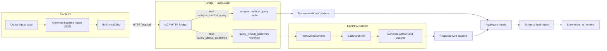

# MCP+RAG 架构与规则说明

## 1. 核心结论：`analyze_medical_query` 为什么没有 citations

在当前实现中（`clinical_rag_system/mcp_http_bridge.py`）：

- **`tool == "analyze_medical_query"` 分支**：
  - 调用 `node_analyze_and_rephrase_query`。
  - 只对原始医学问题做理解、归类、重写，产出**优化后的查询表达**。
  - 返回值形态：

    ```python
    return MCPCallResponse(
        content=content,  # "Query Analysis Result\n\nOriginal Query: ...\nRephrased Query: ..."
        citations=[]      # 明确写死为空列表
    )
    ```

  - 不触发文献/指南检索，不构建 citations。

- **`tool == "query_clinical_guidelines"` 分支**：
  - 调用 `create_clinical_workflow()`，走完整 LangGraph 流程：
    - 分析 & 重写 query；
    - 调 LightRAG 检索；
    - 过滤 / 评分文档；
    - 根据文档生成答案和 citations。
  - 返回值形态：

    ```python
    return MCPCallResponse(
        content=final_state.get('final_generation', ...),
        citations=citation_objects  # 来自最终工作流 state['citations']
    )
    ```

所以使用 `analyze_medical_query` 时看到：

```json
{
  "content": "Query Analysis Result\n\nOriginal Query: ...\nRephrased Query: ...\n...",
  "citations": []
}
```

是**按设计**的行为：L2 只负责“把问题变成适合检索的高质量 query”，不绑定具体文献引用。真正带 citations 的完整 RAG 是 `query_clinical_guidelines` 这条路。

---

## 2. 整体 MCP+RAG 架构

### 2.1 三层结构

- **L1：前端（React + Vite，端口 3003）**
  - 文件：`src/App.tsx`, `src/services/reportGenerator.ts`, `src/services/mcpClient.ts`, `src/utils/prompts.ts`
  - 功能：
    - 接收病历文本，按 3 个阶段（门诊 / 住院 / 出院）生成基线报告。
    - 在基线报告基础上，构造 MCP 调用 JSON（`mcpCalls`），交给后端进行“指南增强”。

- **L2：MCP HTTP Bridge（FastAPI，端口 8787）**
  - 文件：`clinical_rag_system/mcp_http_bridge.py`
  - 功能：
    - 暴露统一的 HTTP 接口 `/mcp/call`。
    - 根据 `tool` 字段路由到不同的 LangGraph 节点/工作流。
    - 把内部复杂的工作流结果转换为简单的 MCP 风格响应：
      - `content: string`
      - `citations: Citation[]`

- **L3：LightRAG / 检索服务（Uvicorn，端口 9621）**
  - 文件：`clinical_rag_system/start_lightrag_custom.py` 等
  - 功能：
    - 维护知识图谱、向量库。
    - 为 LangGraph 节点提供检索、聚类、推理所需要的文献/指南数据。

---

### 2.2 mermaid 流程图（端到端）



- 当前前端默认只构造 `tool: "analyze_medical_query"` 的 `mcpCalls`，所以主要走 A1 → BOUT1 这条路。
- 如果将来前端允许配置 `tool: "query_clinical_guidelines"`，就能走到 WF → R3 → BOUT2 这条“带 citations 的完整 RAG”路径。

---

## 3. `analyze_medical_query` 与 `query_clinical_guidelines` 的职责划分

### 3.1 `analyze_medical_query`（查询分析工具）

- 角色定位：**智能分诊 / query optimizer**。
- 输入：带有诊断、分期、生物标志物等具体信息的自然语言问题。
- 主要输出：
  - 对原始问题的解析；
  - 更规范、适合检索的重写 query。
- 不做的事情：
  - 不直接访问 LightRAG；
  - 不返回 citations。
- 典型用途：
  - 在用户病历 + 基线报告的上下文基础上，自动生成高质量 MCP 查询；
  - 作为前端自动生成 `mcpCalls` 的“上游工具”。

### 3.2 `query_clinical_guidelines`（完整 RAG 工具）

- 角色定位：**终端临床问答 + 引用生成器**。
- 输入：已经相对“干净”的、适合检索的临床问题。
- 内部步骤：
  - 分析 / 重写 query；
  - 调用 LightRAG 检索；
  - 过滤、打分文档；
  - 生成带引用的答案。
- 输出：
  - `content`：根据指南生成的长答案；
  - `citations`：结构化的指南/文献引用列表。
- 典型用途：
  - 当已经有一个清晰的问题，希望直接拿到带指南出处的回答时。

---

## 4. 规则冲突是如何被统一的

最初代码中，几类“规则源”之间存在不一致：

- **前端提示词 (`MCP_QUERY_PROMPT_USER`)**
  - 早期文案里写的是："所有查询必须使用 `query_clinical_guidelines` 工具"。
- **前端 MCP 客户端 (`mcpClient.ts`)**
  - `MCP_TOOL_NAME` 与 `MCP_ANALYZE_TOOL` 曾经混用 `analyze_medical_query` 与 `query_clinical_guidelines`。
  - `optimizeWithMCP` 默认生成的 `mcpCalls` 中工具名不统一。
- **后端 Python 文档（`QUICK_START.md` 等）**
  - 明确指出：`analyze_medical_query` 是主力工具，`query_clinical_guidelines` 更多是 demo / 完整 RAG。
- **后端 HTTP Bridge（`mcp_http_bridge.py`）**
  - 同时支持两种 `tool` 名，但行为不同（是否检索 / 是否返回 citations）。

### 4.1 统一策略

在不破坏已有 RAG 工作流的前提下，统一策略为：

- **前端“唯一合法工具名”：`analyze_medical_query`**
  - 所有从 LLM Prompt 输出的 `mcpCalls` JSON，都要求：
    - `tool: "analyze_medical_query"`。
  - 体现为：
    - `src/utils/prompts.ts` 中的 `MCP_QUERY_PROMPT_USER` 示例与说明全部改为 `analyze_medical_query`。
    - `src/services/reportGenerator.ts` 中，校验 `mcpCalls` 的 JSON schema 与逻辑也改为只接受 `analyze_medical_query`。

- **`query_clinical_guidelines` 保留在 L2 后端，作为“完整 RAG”专家接口**
  - `mcp_http_bridge.py` 仍然支持 `tool == "query_clinical_guidelines"`，可以从工具层/测试脚本直接调用，用于需要完整 RAG 的场景。
  - 这条路返回带 `citations` 的长答案，不影响前端当前的默认行为。

- **MCP 客户端实现统一为“以 `analyze_medical_query` 为主”**
  - `src/services/mcpClient.ts`：
    - `MCP_TOOL_NAME = 'analyze_medical_query'`
    - `MCP_ANALYZE_TOOL = 'analyze_medical_query'`
    - 默认生成的 `mcpCalls` 只包含 `analyze_medical_query`。
  - 如果将来希望引入 `query_clinical_guidelines`，可以在 `optimizeWithMCP` 的 `mcpCalls` 里显式添加一条带这个工具名的调用，而不是让 LLM 自由发挥。

### 4.2 结果

- 对前端/LLM 来说，规则非常简单：
  - MCP 查询一律用 `analyze_medical_query` 工具名。
- 对后端/研发来说，保留了完整 RAG 的能力：
  - 仍然能通过 `tool = "query_clinical_guidelines"` 打通 L2 + L3 的 workflow，获得 citations。
- 不同层之间的语义清晰：
  - `analyze_medical_query` = 分析 & 生成高质量 query；
  - `query_clinical_guidelines` = 用高质量 query 拉起完整检索 + 生成答案 + citations。

---

## 5. 当前状态与后续可选优化

- **当前状态（2025-11 更新）：**
  - 已成功启动：
    - LightRAG（端口 9621，使用 3072 维 `text-embedding-3-large`）
    - MCP HTTP Bridge（端口 8787）
    - 前端 Vite（端口 3003）
  - 前端现在主要使用 `query_clinical_guidelines` 获取完整 RAG + citations。
  - L2 新增 **Evidence Level Grading** 功能，使用 DeepSeek 自动为每条 citation 推断证据等级。
  - Citation Validation 功能已启用，自动过滤幻觉引用。

- **启动命令：**
  ```bash
  # Terminal 1: Frontend
  npm run dev

  # Terminal 2: MCP HTTP Bridge
  npm run mcp

  # Terminal 3: LightRAG Server (3072-dim)
  cd clinical_rag_system
  .venv\Scripts\python.exe start_lightrag_custom.py
  ```

---

## 6. Evidence Level Grading（证据等级推断）

L2 工作流中新增了 `grade_evidence_levels` 函数，在生成 citations 后自动调用 DeepSeek 推断每条引用的证据等级。

### 6.1 统一证据层级映射表

| 统一层级 | NCCN | ESMO | CSCO | JGCA (MINDS/GRADE) | 映射逻辑 |
|----------|------|------|------|---------------------|----------|
| **Tier_1** | Category 1 | Grade A | Level I | Grade A (基于 Level 1) | 最高等级：高质量 RCT/荟萃分析，专家强共识 |
| **Tier_2** | Category 2A | Grade B | Level II | Grade B (基于 Level II-IV) | 中等等级：较低证据但共识度高，或可及性受限 |
| **Tier_3** | Category 2B, 3 | Grade C, D, E | Level III | Grade C, D | 低等级/不推荐/冲突：证据不足或明确反对 |

### 6.2 实现位置

- 文件：`clinical_rag_system/src/l2_langgraph_workflow.py`
- 函数：`grade_evidence_levels(citations: List[dict]) -> List[dict]`
- 调用时机：在 `node_generate_final_answer` 构造 citations 后
- 失败处理：静默回退，不中断主流程

### 6.3 输出示例

```json
{
  "guidelineName": "NCCN Gastric Cancer v2.2024.pdf",
  "source": "NCCN Gastric Cancer v2.2024.pdf",
  "quote": "For patients with locally advanced gastric cancer...",
  "evidenceLevel": "Category 1"
}
```
